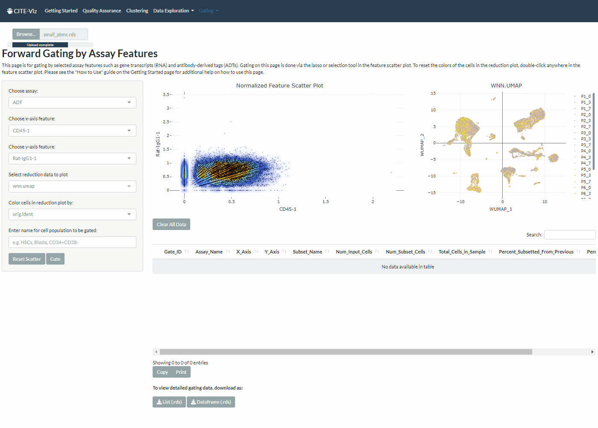
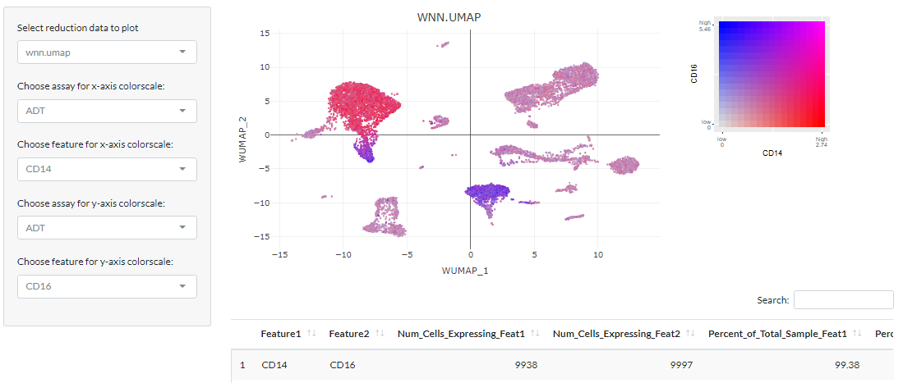

# CITE-Viz: Replicating the Interactive Flow Cytometry Workflow in CITE-Seq

Garth L. Kong, Thai T. Nguyen, Wesley K. Rosales, Anjali D. Panikar, John H. W. Cheney, Brittany M. Curtiss, Sarah A. Carratt, Theodore P. Braun, Julia E. Maxson

## Background

The rapid advancement of new genomic sequencing technology has enabled the development of multi-omic single-cell sequencing assays. These assays profile multiple modalities in the same cell and can often yield new insights not revealed with a single modality. For example, CITE-Seq (Cellular Indexing of Transcriptomes and Epitopes by Sequencing) simultaneously profiles the single-cell RNA transcriptome and the surface protein expression. The extra dimension of surface protein markers can be used to further identify cell clusters – an essential step for downstream analyses and interpretation. Additionally, multi-dimensional datasets like CITE-Seq require nuanced visualization methods to accurately assess the data. To facilitate cell cluster classification and visualization in CITE-Seq, we developed CITE-Viz. 

## About CITE-Viz

CITE-Viz is a single-cell visualization platform with a custom module that replicates the interactive flow-cytometry gating workflow. With CITE-Viz, users can investigate CITE-Seq specific quality control (QC) metrics, view multi-omic co-expression feature plots, and classify cell clusters by iteratively gating on the abundance of cell surface markers. CITE-Viz was developed to make multi-modal single-cell analysis accessible to a wide variety of biologists, with the aim to discover new insights into their data and to facilitate novel hypothesis generation. If you use our package, please cite our paper: [CITE-Viz: Replicating the Interactive Flow Cytometry Workflow in CITE-Seq](https://www.biorxiv.org/content/10.1101/2022.05.15.491411v1)

## Installation & Usage

We recommend installing CITE-Viz through the RStudio IDE using the following commands:

```R
devtools::install_github("maxsonBraunLab/CITE-Viz")
library(CITEViz)
run_app()
```

CITE-Viz installation is currently facilitated with devtools, and the development team is working hard to submit the package to Bioconductor 3.16 with a release schedule of October 2022.

### Feature 1: Forward-Gates

Arguably the most important feature for CITE-Viz, users can gate on a set of features (ADT, RNA, etc.) to subset cells in the dimensional reduction space (e.g. UMAP, PCA, tSNE). Users can use one or multiple layers of gates to enrich for specific cell populations justl like flow cytometry. In the following example, we demonstrate a 2-layer gate to get CD11b-1 CD45-1 cells (mixture of myeloid and lymphoid cells) and CD8+ CD4- cells to get CD8 T cells:



### Feature 2: Back-Gates

Unique to CITE-Viz, users can 'back-gate' on a selection of cells, and highlight them in feature space. We believe this feature can highlight cells in feature space from a "labels-first" or "top-down" workflow. In the following example, we back-gate on a selection of B-cells:


### Feature 3: Quality Control

A set of quality control metrics can be assessed in CITE-Viz, split by any categorical metadata in the input Seurat object. This feature helps users identify potential faulty samples or batch effect. In the following example, CITE-Viz clearly displayed a difference in the Number of Unique ADTs between patient donors P1-P4 and P5-P8.


### Feature 4: Feature (co-)Expression

Co-Expression of features greatly facilitates a holistic view of single-cell multi-omic datasets. For example, this co-expression plot of CD14 and CD16 protein expression show cell population heterogeneity in monocytes in the left cluster. Most monocytes have high CD14 cells and moderate CD16, except for a specific population at the bottom dip that have high CD16 and low CD14. 



## References


Andreatta M, Berenstein AJ, Carmona SJ. scGate: marker-based purification of cell types from heterogeneous single-cell RNA-seq datasets. :3.

Hao Y, Hao S, Andersen-Nissen E, Mauck WM, Zheng S, Butler A, Lee MJ, Wilk AJ, Darby C, Zager M, et al. 2021. Integrated analysis of multimodal single-cell data. Cell. 184(13):3573-3587.e29. doi:10.1016/j.cell.2021.04.048.

Jagla B, Libri V, Chica C, Rouilly V, Mella S, Puceat M, Hasan M. 2021. SCHNAPPs - Single Cell sHiNy APPlication(s). Journal of Immunological Methods. 499:113176. doi:10.1016/j.jim.2021.113176.

Macosko EZ, Basu A, Satija R, Nemesh J, Shekhar K, Goldman M, Tirosh I, Bialas AR, Kamitaki N, Martersteck EM, et al. 2015. Highly Parallel Genome-wide Expression Profiling of Individual Cells Using Nanoliter Droplets. Cell. 161(5):1202–1214. doi:10.1016/j.cell.2015.05.002.

Ouyang JF, Kamaraj US, Cao EY, Rackham OJL. 2021. ShinyCell: simple and sharable visualization of single-cell gene expression data. Mathelier A, editor. Bioinformatics. 37(19):3374–3376. doi:10.1093/bioinformatics/btab209.

Pont F, Tosolini M, Gao Q, Perrier M, Madrid-Mencía M, Huang TS, Neuvial P, Ayyoub M, Nazor K, Fournié J-J. 2020. Single-Cell Virtual Cytometer allows user-friendly and versatile analysis and visualization of multimodal single cell RNAseq datasets. NAR Genomics and Bioinformatics. 2(2):lqaa025. doi:10.1093/nargab/lqaa025.

Stoeckius M, Hafemeister C, Stephenson W, Houck-Loomis B, Chattopadhyay PK, Swerdlow H, Satija R, Smibert P. 2017. Simultaneous epitope and transcriptome measurement in single cells. Nat Methods. 14(9):865–868. doi:10.1038/nmeth.4380.
